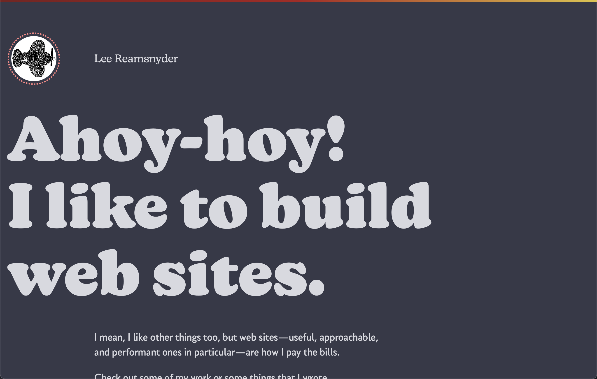
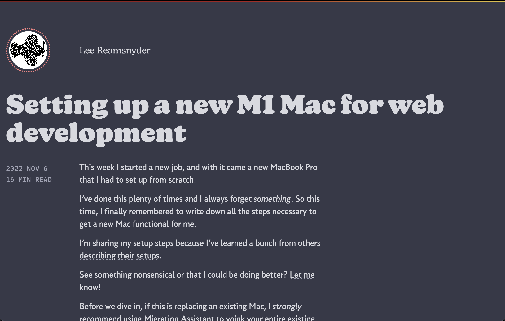

## What is this?

This is the source code for https://www.leereamsnyder.com from 2021–2023. I'm putting this code out there for others to learn from, if they're interested.

### Features of note:

- Write sequential content (like blog articles) in Markdown. Files are sorted by dates in the file names.
- Images in markdown will [automatically be output with a path](https://github.com/leereamsnyder/lee-reamsnyder-dot-com-v5/blob/main/src/lib/data/markdownToHtml.js#L134-L154) and a [Netlify rewrite](https://github.com/leereamsnyder/lee-reamsnyder-dot-com-v5/blob/main/netlify/plugins/cloudinary-image-rewrite/index.js) that will serve up automatically resized and optimized images from Cloudinary (you'll need a cloudinary account for this)
- This'll generate all the usual stuff like RSS feeds of the blog posts and a sitemap
- There's [a service worker](https://github.com/leereamsnyder/lee-reamsnyder-dot-com-v5/blob/main/src/service-worker.js) that caches static content and can allow the site to work (with limited functionally) while visitors are offline

For reference, the home page looked like this:

And an article looked like this:

It is currently a [SvelteKit](https://kit.svelte.dev) application. The build process outputs static HTML and it is designed to be deployed on Netlify, which handles redirects, headers, and other bits [like image URL rewrites to Cloudinary](https://github.com/leereamsnyder/lee-reamsnyder-dot-com-v5/blob/main/netlify/plugins/cloudinary-image-rewrite/index.js).

## Installation

1. You need `node` 16+: `brew install node`
1. This package uses `node-canvas` which has a bunch of additional requirements. [See here for the latest](https://www.npmjs.com/package/canvas), but as of this writing I had to: `brew install pkg-config cairo pango libpng jpeg giflib librsvg`
1. Run `npm install`

## Development

1. Run `npm run dev` to start up the SvelteKit server. Typically you’ll be up and running at `http://localhost:5173`

## How is this organized?

The site is mostly handled by SvelteKit. The app code starts in `src/`, specifically `src/routes/` for the URL route definitions.

Sequential content is stored in the `content` directory. There's a data method `getChildFiles` that can grab .md markdown files from folders there (eg `content/blog/`). The markdown files can have metadata, and they'll be sorted by the date at the start of the the filenames eg `2022-12-25-merry-christmas.md`.

## Why SvelteKit?

- I really like Svelte for building component-y websites. The output is small, CSS is first-class, the language is delightful, and it's generally easy to do whatever you might have to do client-side. [Version 4 of this site](https://www.leereamsnyder.com/blog/back-in-action-with-a-new-look) used Svelte under the covers with a whole lot of manual build steps.
- SvelteKit, meanwhile, makes it easy to use Svelte to build whole-ass websites/applications. It handles concerns like spinning up a dev server, routing, gathering data, building the site, and outputting css/js/image assets with easy-to-cache file names.
- Sometimes it's just nice to have a server, and SvelteKit also lets you do pretty much whatever you want as long as you can return it in a `Response`, and I do that to build dynamic things [like dithered images](https://github.com/leereamsnyder/lee-reamsnyder-dot-com-v5/blob/main/src/lib/components/DitheredImage.svelte), [Open Graph (social media sharing) images](https://github.com/leereamsnyder/lee-reamsnyder-dot-com-v5/blob/main/src/routes/og-image-generator/%5B...path%5D/og-image.jpg/%2Bserver.js) ([full process outlined in this blog post](https://www.leereamsnyder.com/blog/dynamic-social-media-images-with-sveltekit-and-resvg-js)), or [an RSS feed](https://github.com/leereamsnyder/lee-reamsnyder-dot-com-v5/blob/main/src/routes/rss.xml/%2Bserver.js).

I want to stress that for a boring static website, _this is over-engineered_. If you just want to get a site out there, dedicated static site generators like https://www.11ty.dev or https://jekyllrb.com or https://gohugo.io might be a better fit.

## This uhh doesn't look like your site bro

Yeah, I've removed all the bits under copyright (images, icons, and fonts) that I can't put in a public git repository. I've commented out the code that loads custom web fonts, because those files were being `import`ed.

This will start up, but it'll look wonky, none of my actual article content is here, images are missing, the tests will fail, and it won't successfully build. But it's got enough that you can play around with it.
